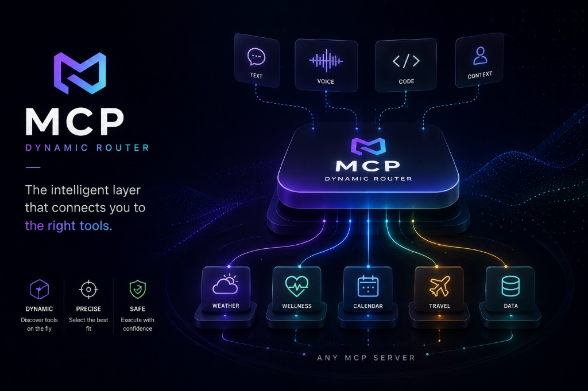
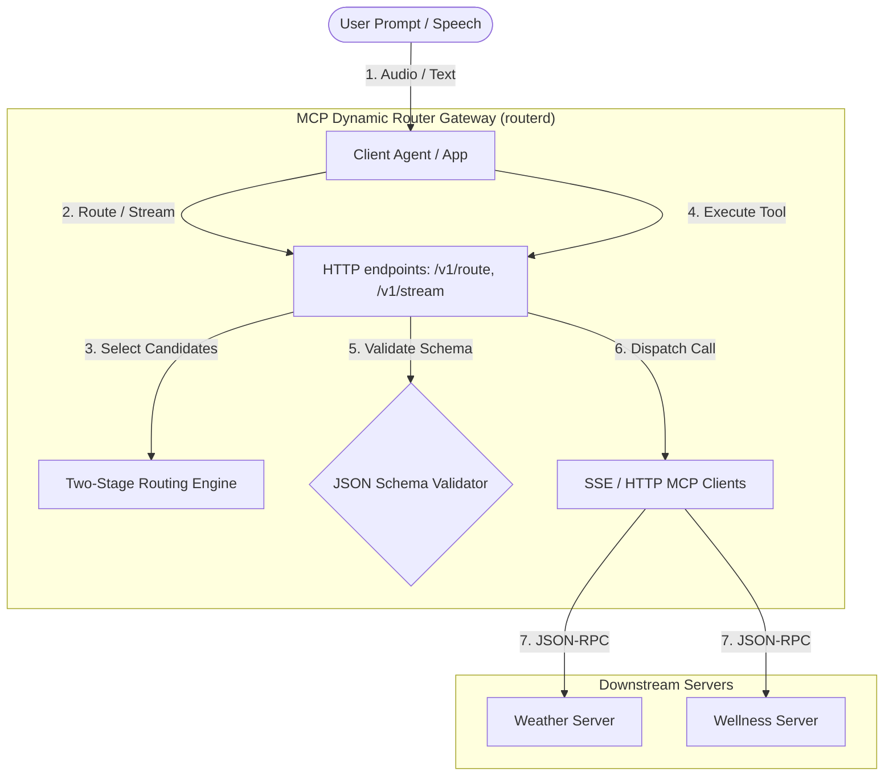
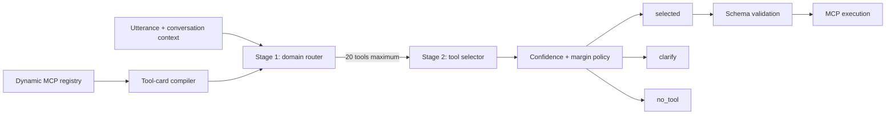

# MCP Dynamic Router

<div align="center">
  
</div>

<p align="center">
  <a href="https://github.com/kavinbm16/Mcp-Dynamic-Router/actions"></a>
  <a href="https://goreportcard.com/report/github.com/kavinbm16/Mcp-Dynamic-Router"></a>
  <a href="https://pkg.go.dev/github.com/kavinbm16/mcp-dynamic-router"></a>
  <a href="LICENSE"></a>
</p>

<h3 align="center">Give your voice pipeline thousands of tools. Let the model see only the right few.</h3>

<p align="center">
MCP Dynamic Router is a high-performance, description-first, two-stage Model Context Protocol (MCP) tool router written in Go. It connects to dynamic MCP servers, translates streaming voice transcripts into ranked tool routing decisions on the fly, and automatically abstains when confidence is low.



---

## ⚡ Key Capabilities

* **🔌 Dynamic Server Orchestration** — Concurrently connects to multiple MCP servers via HTTP/SSE, handling live hot-reloads when tool schemas are updated.
* **📈 Stream RAG Engine** — Starts routing partial transcripts *while the user is still speaking* to warm downstream connections and prefetch read-only tools safely.
* **🎯 Hybrid Scoring & Reranking** — Blends BM25 lexical scoring, semantic vector embeddings, and LLM-based reranking for precise, low-latency selection.
* **🛡️ Secure Abstention Policy** — Abstains from routing when inputs are ambiguous or below confidence thresholds to prevent errant mutations.
* **🚀 Multi-Language Compatibility** — Embed directly in your Go codebase or deploy as a lightweight local HTTP sidecar companion to Python, TypeScript, LiveKit, or Pipecat agents.

```text
"Could you check the weather in Bengaluru tom—"
                         │
                         ├── partial transcript → domain retrieval → tool shortlist
                         │                                      └── warm safe context
                         │
"...tomorrow morning?" ─┴── final transcript → confirm route → bind → execute
```

The router is completely **provider-neutral**; it integrates seamlessly with any STT, LLM, TTS, realtime voice API, or agent framework.

> **Status:** Active development. Dynamic registry discovery, automated tool auditing, hybrid retrieval, Stream RAG, schema validation, and HTTP sidecar are fully implemented and tested.


## The 60-second path

### 1. Describe your MCP servers

Create `mcp.toml`:

```toml
[elicitation]
enabled = true
auto_accept = false
timeout = 30

[[servers]]
name = "weather-service"
url = "http://localhost:23202/weather/mcp"
transport = "streamable-http"

[[servers]]
name = "wellness-service"
url = "http://localhost:23002/wellness/mcp"
transport = "streamable-http"
```

Add another server by adding another block. No keyword maps and no code changes.

### 2A. Drop it into Go

```go
package main

import (
    "context"
    "fmt"

    dynamicrouter "github.com/kavinbm16/mcp-dynamic-router"
    "github.com/kavinbm16/mcp-dynamic-router/router"
)

func main() {
    ctx := context.Background()
    app := dynamicrouter.New(dynamicrouter.Options{MCPConfigPath: "mcp.toml"})
    defer app.Close()

    report, err := app.Start(ctx)
    if err != nil { panic(err) }
    fmt.Println("connected:", report.Connected)

    result, err := app.Route(ctx, router.RouteRequest{
        Utterance: "Will I need an umbrella in Bengaluru tomorrow?",
        Context:   "User timezone: Asia/Kolkata",
        Final:     true,
    })
    if err != nil { panic(err) }

    fmt.Println(result.Decision, result.Candidates[0].Tool.ID)
}
```

### 2B. Or run the sidecar beside any pipeline

```bash
go run ./cmd/routerd -mcp mcp.toml
```

Route a final utterance:

```bash
curl -s http://127.0.0.1:8090/v1/route \
  -H 'content-type: application/json' \
  -d '{
    "utterance": "Will I need an umbrella in Bengaluru tomorrow?",
    "context": "User timezone: Asia/Kolkata",
    "final": true
  }'
```

Then execute the selected tool (the sidecar proxies the call to the downstream MCP server and automatically validates arguments against the tool's JSON schema):

```bash
curl -s http://127.0.0.1:8090/v1/execute \
  -H 'content-type: application/json' \
  -d '{
    "tool_id": "weather-service.get_forecast",
    "arguments": {
      "location": "Bengaluru",
      "units": "metric"
    }
  }'
```

That is the complete integration boundary: JSON in, routing decision and tool execution output out. The client does not need any MCP-specific connection code.

## Stream RAG: route before the user stops speaking

Normal tool routing waits for end-of-turn. Stream RAG spends that otherwise idle speech time retrieving the likely domain and tool.

The included Stream RAG session does four precise things:

1. Ignores partials that are too short or have weak ASR confidence.
2. Cancels routing for an older partial when a newer hypothesis arrives.
3. Marks a route stable only after the same tool wins consecutive updates.
4. Allows prefetch only for tools marked `readOnly`; final transcripts alone trigger commit.

It never treats a partial transcript as permission to perform a side effect.

### From any language over HTTP

Send partial ASR updates as they arrive:

```bash
curl -s http://127.0.0.1:8090/v1/stream \
  -H 'content-type: application/json' \
  -d '{
    "session_id": "call-42",
    "transcript": "check the weather in Bengaluru",
    "confidence": 0.91,
    "final": false
  }'
```

Then commit the final transcript with the same session ID:

```bash
curl -s http://127.0.0.1:8090/v1/stream \
  -H 'content-type: application/json' \
  -d '{
    "session_id": "call-42",
    "transcript": "check the weather in Bengaluru tomorrow morning",
    "confidence": 0.97,
    "final": true
  }'
```

Each response contains `triggered`, `stable`, `stability_count`, the routing decision, candidates, confidence, margin, and phase latencies. Final requests automatically close their server-side Stream RAG session; abandoned sessions expire after two minutes.

### Directly inside Go

```go
session := app.NewStream(streamrag.DefaultOptions(), streamrag.Hooks{
    OnPrediction: func(p streamrag.Prediction) {
        log.Printf("partial route stable=%v decision=%s", p.Stable, p.Result.Decision)
    },
    OnPrefetch: func(ctx context.Context, tool router.Tool) error {
        // Warm a cache or downstream connection. Never execute a mutation here.
        return warm(tool)
    },
    OnCommit: func(p streamrag.Prediction) {
        // The transcript is final. Continue to argument binding and policy.
        commit(p.Result)
    },
})
defer session.Close()

session.Submit(ctx, streamrag.Event{
    Transcript: partialTranscript,
    Confidence: asrConfidence,
    Final:      false,
})
```

`Submit` is asynchronous and returns immediately. `Update` offers the same state machine synchronously for request/response transports.

## Where it fits

| Pipeline | Integration point |
|---|---|
| Cascaded STT → LLM → TTS | Send every useful STT partial to `/v1/stream`; send the end-of-turn transcript with `final:true`. |
| Native speech-to-speech API | Mirror transcript events into Stream RAG; return the final selected schema to the realtime model. |
| Text agent | Call `/v1/route` once per final user message. |
| Go agent | Embed the root `dynamicrouter.App`. |
| Python or TypeScript agent | Run `routerd` as a local sidecar and use ordinary HTTP JSON. |
| Multi-agent system | Run one shared router service or one registry-isolated instance per trust boundary. |

The pipeline owns audio and conversation UX. The router owns discovery, narrowing, ranking, uncertainty, and MCP connections.

## Accuracy begins in the tool description

A router cannot infer a limitation that the tool never states. A 2026 analysis of 856 MCP tools reported that **97.1% contained at least one description defect**. See the [MCP tool-description quality study](https://arxiv.org/abs/2602.14878).

Use this format in the ordinary MCP `description` field:

```text
Domain: calendar

Purpose: Create a new event in the user's calendar.

Invoke when: Call this tool when the user explicitly asks to schedule,
book, or add a calendar event.

Parameters:
- title (string, required): Short event title. Spoken example: "dentist appointment".
- start_time (string, required): ISO-8601 time resolved in the user's timezone.
  Spoken example: "tomorrow at three".
- timezone (string, optional): IANA timezone such as "Asia/Kolkata".

Limitations:
- Does not search, update, or delete existing events.
- Must not be called when the user is only asking about availability.
- Requires confirmation before inviting external attendees.

Example:
User: "Schedule lunch with Mira tomorrow at noon."
Arguments: {"title":"Lunch with Mira","start_time":"2026-06-30T12:00:00+05:30","timezone":"Asia/Kolkata"}
```

Why these fields matter:

| Field | What it gives the router |
|---|---|
| `Domain` | A small first-stage search space. |
| `Purpose` | Positive semantic identity. |
| `Invoke when` | Natural utterance patterns and intent boundaries. |
| `Parameters` | Spoken-to-schema grounding. |
| `Limitations` | Negative evidence against confusing neighbors. |
| `Example` | A realistic bridge from speech to valid arguments. |

`Domain` is a router convention rather than an MCP requirement. Set `Tool.Domain` directly, include `Domain:` in the description, or let the router fall back to the MCP server name.

The JSON Schema should repeat every machine-enforceable fact:

```json
{
  "type": "object",
  "properties": {
    "title": {
      "type": "string",
      "description": "Short event title inferred from the user's words"
    },
    "timezone": {
      "type": "string",
      "description": "IANA timezone",
      "examples": ["Asia/Kolkata"]
    }
  },
  "required": ["title"],
  "additionalProperties": false
}
```

Audit descriptions locally or in CI:

```bash
go run ./cmd/router-audit -tools testdata/tools.json -minimum 90
```

The command exits non-zero when a description fails the policy.

## How routing works



### Stage 1: domain router

The registry is grouped into explicit domain documents. BM25 and optional embedding retrieval choose the relevant domain buckets, then cap the active pool at 20 tools. Large domains are internally ranked before truncation; tool order never decides the shortlist.

### Stage 2: tool selector

Choose the cost/accuracy point your pipeline needs:

- **Lexical:** dependency-free BM25.
- **Hybrid:** BM25 and embedding similarity fused together.
- **Reranked:** hybrid retrieval plus a small constrained-output LLM over the shortlist.

#### Score Fusion Formula

When using hybrid routing, lexical and semantic scores are normalized and fused using your configured weights:

1. **Normalize Scores**: For both lexical and semantic runs, individual scores are normalized by the maximum score in that set:
   $$S_{norm} = \frac{S}{S_{max}}$$
2. **Weight Fusing**: Normalized weights are computed as:
   $$W_{lex\_norm} = \frac{W_{lex}}{W_{lex} + W_{sem}}, \quad W_{sem\_norm} = \frac{W_{sem}}{W_{lex} + W_{sem}}$$
   $$S_{fused} = W_{lex\_norm} \cdot S_{lex\_norm} + W_{sem\_norm} \cdot S_{sem\_norm}$$
3. **Reranker Interpolation**: If a stage-two reranker is enabled, the final score interpolates the fused score and the reranker score ($S_{rerank} \in [0, 1]$):
   $$S_{final} = (1 - W_{reranker}) \cdot S_{fused} + W_{reranker} \cdot S_{rerank}$$

### Abstention

The router returns:

- `selected` when confidence and top-1 margin both pass;
- `clarify` when plausible tools are too close;
- `no_tool` when no candidate is strong enough.

Wrong actions are not a latency optimization. Confidence thresholds must be calibrated on your held-out data.

#### Calibrating the Decision Policy

The policy uses two hyperparameters from your config to control routing behavior:

| Parameter | Type | Default | Tuning Strategy |
|---|---|---|---|
| `MinConfidence` | float | `0.42` | **Raise** to reduce false-positive routings (e.g., routing random chat to tools). **Lower** if valid intents are getting classified as `no_tool`. |
| `MinMargin` | float | `0.06` | **Raise** to enforce strict disambiguation (yields `clarify` if tools are close). **Lower** if similar tools are safe to execute interchangeably. |

## Optional local intelligence

Enable Ollama embeddings and a stage-two selector in the sidecar:

```bash
go run ./cmd/routerd \
  -mcp mcp.toml \
  -ollama http://localhost:11434 \
  -embedding-model nomic-embed-text \
  -selector-model qwen3:4b
```

Or configure them in Go:

```go
app := dynamicrouter.New(dynamicrouter.Options{
    MCPConfigPath: "mcp.toml",
    Embedder: &embedding.Ollama{
        BaseURL: "http://localhost:11434",
        Model:   "nomic-embed-text",
    },
    Reranker: &selector.Ollama{
        BaseURL: "http://localhost:11434",
        Model:   "qwen3:4b",
    },
})
```

Both interfaces are replaceable. Implement `router.Embedder` or `router.Reranker` to use another local model, hosted API, or specialized classifier.

## Dynamic MCP behavior

- Servers connect concurrently from `mcp.toml`.
- One failed server does not disable healthy servers.
- Connections use reusable Streamable HTTP sessions.
- `notifications/tools/list_changed` atomically replaces that server's tools and rebuilds the index.
- In-flight requests continue against their immutable snapshot.
- Tool arguments can be checked with `router.ValidateArguments` before execution.

### Elicitation

- `enabled=false`: no elicitation handler is advertised.
- `enabled=true, auto_accept=false`: requests are declined unless the application supplies `mcpclient.WithElicitationHandler`.
- `auto_accept=true`: requests are accepted automatically. Avoid this for consequential tools.
- `timeout`: application-handler deadline in seconds.

Voice applications should map elicitation into their own user-confirmation state machine. Silence is not consent.

## Measure it

The included evaluator reads a tool registry and labelled JSONL:

```json
{"utterance":"Will I need an umbrella in Bengaluru?","expected_tool":"weather.get_forecast"}
{"utterance":"Tell me a bedtime story","expected_tool":""}
```

Run the lexical baseline:

```bash
go run ./cmd/router-eval -tools testdata/tools.json -cases testdata/cases.jsonl
```

Run hybrid retrieval:

```bash
go run ./cmd/router-eval \
  -tools testdata/tools.json \
  -cases testdata/cases.jsonl \
  -ollama http://localhost:11434 \
  -model nomic-embed-text
```

The report includes top-1 accuracy, top-5 recall, false routing on no-tool requests, and P50/P95 routing latency.

A credible dataset includes confusing tool pairs, real ASR errors, no-tool requests, spoken names and numbers, cross-turn context, and registries at multiple scales. Tune on development data; publish results on a held-out test set.

## HTTP API

`routerd` binds to `127.0.0.1:8090` by default. Set `-listen` deliberately when exposing it beyond the local machine; authentication and TLS belong at the deployment boundary.

### Endpoints

#### `GET /healthz`
Returns `200 OK` if the process is up and healthy.
**Response**:
```json
{
  "status": "ok"
}
```

#### `POST /v1/route`
Routes a single utterance without session state.
**Request**:
```json
{
  "utterance": "Will I need an umbrella in Bengaluru tomorrow?",
  "context": "User timezone: Asia/Kolkata",
  "final": true
}
```
**Response**:
```json
{
  "decision": "selected",
  "confidence": 0.854,
  "margin": 0.352,
  "candidates": [
    {
      "tool": {
        "id": "weather-service.get_forecast",
        "server": "weather-service",
        "name": "get_forecast",
        "domain": "weather",
        "description": "Domain: weather\nPurpose: Get forecast...",
        "input_schema": {
          "type": "object",
          "properties": {
            "location": { "type": "string" }
          },
          "required": ["location"]
        }
      },
      "score": 0.854,
      "lexical_score": 0.9,
      "semantic_score": 0.8,
      "rank": 1
    }
  ],
  "reason": "top candidate passed confidence and margin thresholds",
  "trace": {
    "registry_version": 1,
    "domains": ["weather"],
    "domain_latency": 1500000,
    "select_latency": 2500000,
    "total_latency": 4000000,
    "used_embeddings": true,
    "used_reranker": false
  }
}
```
*(Note: Latency values in `trace` are represented in nanoseconds.)*

#### `POST /v1/stream`
Routes incremental user transcripts linked to a session.
**Request**:
```json
{
  "session_id": "session-101",
  "transcript": "check the weather in Bengaluru",
  "confidence": 0.91,
  "final": false
}
```
**Response**:
```json
{
  "triggered": true,
  "final": false,
  "stable": true,
  "stability_count": 2,
  "result": {
    "decision": "selected",
    "confidence": 0.854,
    "margin": 0.352,
    "candidates": [
      {
        "tool": {
          "id": "weather-service.get_forecast",
          "server": "weather-service",
          "name": "get_forecast",
          "domain": "weather",
          "description": "Domain: weather\nPurpose: Get forecast...",
          "input_schema": {
            "type": "object",
            "properties": {
              "location": { "type": "string" }
            },
            "required": ["location"]
          }
        },
        "score": 0.854,
        "lexical_score": 0.9,
        "semantic_score": 0.8,
        "rank": 1
      }
    ],
    "reason": "top candidate passed confidence and margin thresholds",
    "trace": {
      "registry_version": 1,
      "domains": ["weather"],
      "domain_latency": 1500000,
      "select_latency": 2500000,
      "total_latency": 4000000,
      "used_embeddings": true,
      "used_reranker": false
    }
  }
}
```
*(Note: Sending a request with `"final": true` automatically closes the session on the server; unused sessions expire after 2 minutes.)*

## Integration Blueprints & Examples

For real-time voice, streaming STT/ASR, and embedded application pipelines, you can find full runnable implementation blueprints under the `/examples` directory:

* **Go Application Embed:** [main.go](examples/go_embed/main.go) — Demonstrates how to import the `dynamicrouter` library directly in Go, reload configurations, and run stateless `Route` or stateful `streamrag.Session` calls without a sidecar.
* **Pipecat (Python):** [pipecat_router.py](examples/pipecat/pipecat_router.py) — Demonstrates how to pipe speech transcription updates to `routerd` to handle real-time prefetching and committed tool execution.
* **LiveKit Agents (Python):** [livekit_agent.py](examples/livekit/livekit_agent.py) — Hook into user speech transcription and commitment events to stream partials and execute final tool decisions.
* **OpenAI Realtime API (Python):** [openai_realtime_session.py](examples/openai_realtime/openai_realtime_session.py) — Interface with an OpenAI Realtime WebSockets session, intercepting `invoke_tool` intents and executing them via the sidecar.

## Repository map

| Path | Responsibility |
|---|---|
| `dynamicrouter.go` | One-constructor Go facade. |
| `router/` | Registry, audit, domain routing, selection, abstention, schema checks. |
| `streamrag/` | Cancellable partial routing, stability, safe prefetch, final commit. |
| `mcpclient/` | `mcp.toml`, official MCP SDK, hot discovery, execution. |
| `embedding/` | Optional Ollama batch embeddings. |
| `selector/` | Optional Ollama constrained-output reranker. |
| `cmd/routerd/` | Provider-neutral HTTP sidecar. |
| `cmd/router-audit/` | Description-quality CI gate. |
| `cmd/router-eval/` | Accuracy, rejection, and latency evaluator. |

## 🎯 Core Tenets

* **Quality Descriptions:** Tool descriptions are treated as executable code, not decoration.
* **Broad Retrieval, Narrow Reasoning:** Cast a wide net during stage-1 retrieval, then prune aggressively.
* **Stream Safety:** Partial transcripts only prefetch safe read-only tools; they never authorize mutations.
* **Safe Abstention:** We prefer returning `clarify` or `no_tool` over executing a confident wrong action.
* **Separation of Policy:** Routing decisions and tool execution remain separate boundaries.
* **Inspectable & Benchmarkable:** Every routing path and latency budget must be fully auditable.

## 🚀 Roadmap

* [ ] Public speech-routing benchmark & confusion-set generator.
* [ ] Held-out confidence calibration.
* [ ] Schema-constrained argument binder and self-repair loop.
* [ ] Multi-intent dependency DAG with parallel execution.
* [ ] Production integrations for LiveKit, Pipecat, OpenAI Realtime, and Gemini Live.
* [ ] OpenTelemetry and Prometheus instrumentation.
* [ ] Voxa integration with perceived-latency measurements.

## Contributing

The highest-value contributions are difficult tool pairs, labelled spoken utterances, real ASR failures, and reproducible latency results.

```bash
go test -race ./...
go vet ./...
go run ./cmd/router-audit
go run ./cmd/router-eval
```

Include benchmark impact with any ranking-policy change.

## License

MIT. See [LICENSE](LICENSE).
